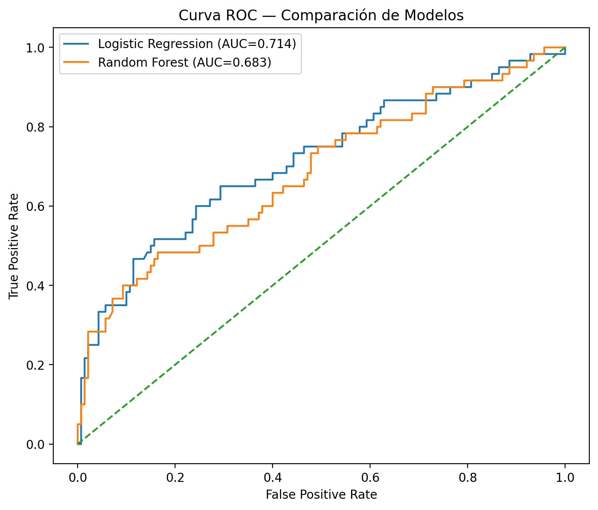
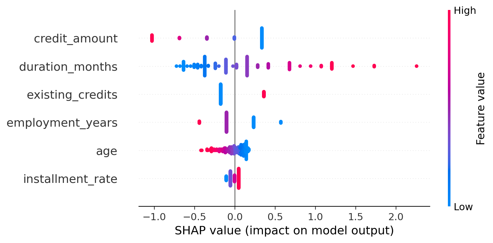
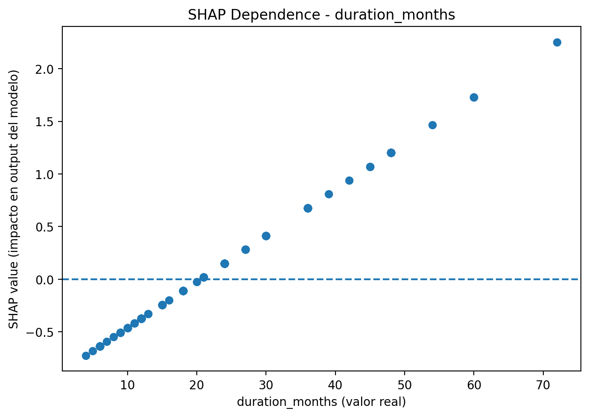

# Credit Risk Scoring — German Credit Dataset

**Logistic Regression | SHAP Interpretability | Cost-Based Threshold Optimization | Banking-Oriented Governance**

---

## 🎯 Objective

Develop an interpretable credit risk model to estimate the probability of default (PD) and support lending decisions in a traditional banking context.

The project combines:

- Predictive modeling
- Business-driven threshold optimization
- Model interpretability (SHAP)
- Governance-oriented validation approach

---

## 📊 Dataset

German Credit Dataset  
1,000 observations  

Target distribution:
- 70% non-default
- 30% default

Target transformation:
- 0 = Non-default
- 1 = Default

---

## 🔎 Final Model Features

- `duration_months`
- `credit_amount`
- `age`
- `installment_rate`
- `existing_credits`
- `employment_years`

These variables represent credit exposure, loan structure, borrower stability, and indebtedness.

---

## 🤖 Models Evaluated

### Logistic Regression (Selected Model)

**ROC-AUC ≈ 0.71**

Chosen due to:

- Better performance than Random Forest
- Full interpretability
- Regulatory alignment
- Transparent decision logic

---

### Random Forest (Benchmark)

**ROC-AUC ≈ 0.68**

Used as technical benchmark but underperformed compared to Logistic Regression.

---

## 📈 ROC Curve Comparison

---

## 💰 Threshold Optimization (Cost-Based Approach)

Instead of using the default 0.5 threshold, a financial cost matrix was applied:

- High cost for False Negatives (granting risky credit)
- Lower cost for False Positives (rejecting safe clients)

This demonstrates how decision rules must be aligned with economic impact rather than statistical defaults.

---

## 🧠 Model Interpretability (SHAP)

The model includes:

- Global feature importance (SHAP summary)
- Individual decision explanation (waterfall plot)
- Feature impact analysis (dependence plots)

### SHAP Summary

### SHAP Dependence — Duration

---

## 🏛 Model Governance Perspective

The project incorporates banking-oriented best practices:

- Stratified train/test validation
- Performance evaluation using ROC-AUC
- Cost-sensitive decision framework
- Drift monitoring recommendation
- Backtesting and stability considerations

---

## 📁 Project Structure
